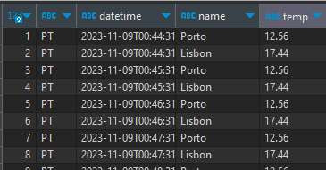

# [Quarkus + Kafka] : "Temperature Monitoring in Two Cities"

This application is designed to collect and process temperature data from two distinct cities and store them for later analysis. In this specific case, it collects the temperature data from Porto and Lisbon every 2 minutes and saves the data to a PostgreSQL database.

## Challenge Description

The goal of this challenge is to create an application composed of two microservices: a producer and a consumer.

- The **Producer** microservice is responsible for collecting temperature data from two different cities at regular intervals (e.g., every 5 minutes) and sending them to a topic on a message broker. Each message should contain information about the city, temperature, and date and time.

- The **Consumer** microservice should consume data from the message broker's topic in real-time and store it in a PostgreSQL database for later analysis.

## Technologies :computer:

This project uses the following technologies:
- [Quarkus](https://quarkus.io/)
- [Apache Kafka](https://kafka.apache.org/)
- [PostgreSQL](https://www.postgresql.org/)
- [Docker](https://www.docker.com/)

## Repository Structure :construction:

The repository is organized as follows:

- `kafka-consumer/`: Source code and resources for the Consumer microservice, implemented with Quarkus.
- `kafka-producer/`: Source code and resources for the Producer microservice.
- `docker-compose.yml`: Docker Compose configuration file to initialize the containers.
- `start.sh`: This script compiles the two Docker images and executes the Docker Compose.

## Prerequisites :warning:

 To run this project, you must have:
-  [Docker](https://www.docker.com/) -- for building & initialize the containers.
-  [Java 11 or later](https://www.java.com/en/download/manual.jsp)-- quarkus dependency
-  [Maven](https://maven.apache.org/install.html) -- for building the packages.
-  [WSL](https://learn.microsoft.com/en-us/windows/wsl/install) or [GitBash](https://git-scm.com/downloads) -- for running the execution script.

## Configuration and Usage :wrench:

OpenWeatherAPI - In ./kafka-producer/src/main/resources/application.properties and change the "openweather.api.key" property with your own key. 

Make sure you have <b><u>Docker installed and running</u></b>: 


``> docker info`` 


 In the <b><u>root directory</u></b> of this project, <b><u>run the script</u></b> using the following command: 


``> ./start.sh`` 

 This script builds the two docker images from the source code and initializes them in containers. After the containers are up and running, use your database viewer tool (e.g., DBeaver) and configure it as follows:

```bash
# Database Connection
Username: postgres
Password: postgres
URL: jdbc:postgresql://localhost:5432/city-temp-db
```
 The <b><u>database is always cleared when the project executes.</u></b> This is done so that you can see the insertion of data more easily, for demonstration purposes.<br> <br>Right-click the table and refresh it and view the data. It should have some new data <b><u>after every two minutes</u></b>:



# Conclusion :rocket:

I hope you can use this project to learn more about implementing these technologies all together. Happy coding! :coffee:
